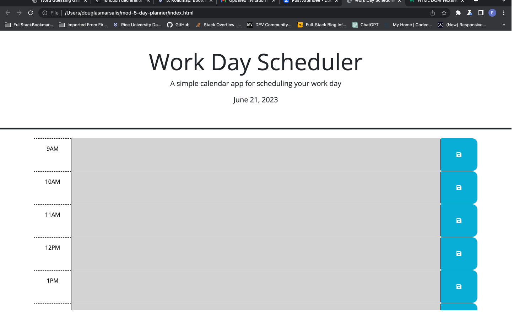
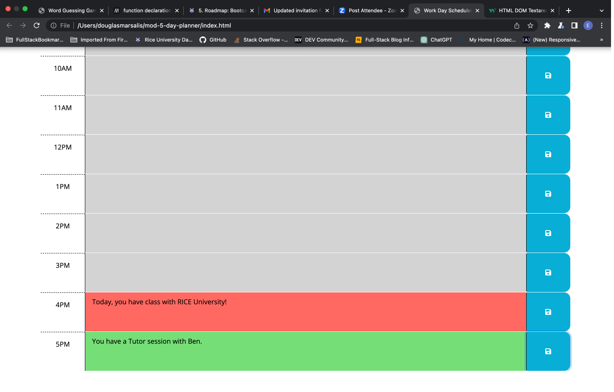
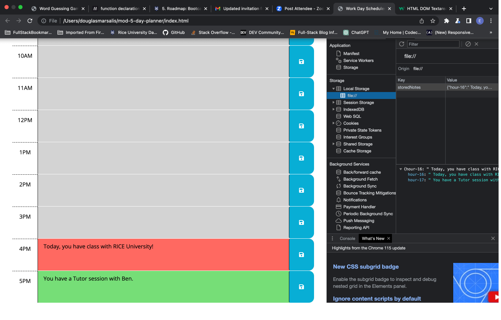

# mod-5-day-planner

## Description

First item - As a web developer, I want to be able to schedule important tasks throughout my day using a day planner. This day planner is able to show current, future and past color slots for me to easily see and schedule my tasks.
Second item - I will make sure the code follows industry standards and is sourced correctly.
Third item - By building this webpage, it also helped me to learn inforamtion on HTML, CSS, JavaScript, Git, GitHub, README markdown information, and Deployment. Also, the usage of JQUERY third party APIs.

## Task

Create a simple calendar application that allows a user to save events for each hour of a typical working day (9am&ndash;5pm) by modifying starter code. This app will run in the browser and feature dynamically updated HTML and CSS powered by jQuery.

You'll need to use the [Day.js](https://day.js.org/en/) library to work with date and time. Be sure to read the documentation carefully and concentrate on using Day.js in the browser.

## Acceptance Criteria

```md
GIVEN I am using a daily planner to create a schedule
WHEN I open the planner
THEN the current day is displayed at the top of the calendar
WHEN I scroll down
THEN I am presented with timeblocks for standard business hours of 9am&ndash;5pm
WHEN I view the timeblocks for that day
THEN each timeblock is color coded to indicate whether it is in the past, present, or future
WHEN I click into a timeblock
THEN I can enter an event
WHEN I click the save button for that timeblock
THEN the text for that event is saved in local storage
WHEN I refresh the page
THEN the saved events persist

## Sources

- First item Various websites for how to do certain tasks:
  W3 Schools - https://www.w3schools.com/
  Stackoverflow - https://stackoverflow.com/
  Mozilla mdn - https://developer.mozilla.org/en-US/
  Geeks for Geeks - https://geeksforgeeks.org
  Dayjs - https://day.js.org/docs/en/display/format
  jQuery API - https://api.jquery.com/jQuery.css
  Local Storage - https://blog.logrocket.com/localstorage-javascript-complete-guide/
- Second item A special thank you to my tutor Ben.

## Link to Deployed Site

https://douglasmarsalis.github.io/mod-5-day-planner/

## Link to Github Repository

https://github.com/douglasmarsalis/mod-5-day-planner/tree/main

## Screenshot of Webpage







## License

MIT License

Copyright (c) 2023 Douglas Eric Marsalis

Permission is hereby granted, free of charge, to any person obtaining a copy of this software and associated documentation files (the "Software"), to deal in the Software without restriction, including without limitation the rights to use, copy, modify, merge, publish, distribute, sublicense, and/or sell copies of the Software, and to permit persons to whom the Software is furnished to do so, subject to the following conditions:

The above copyright notice and this permission notice shall be included in all copies or substantial portions of the Software.

THE SOFTWARE IS PROVIDED "AS IS", WITHOUT WARRANTY OF ANY KIND, EXPRESS OR IMPLIED, INCLUDING BUT NOT LIMITED TO THE WARRANTIES OF MERCHANTABILITY, FITNESS FOR A PARTICULAR PURPOSE AND NONINFRINGEMENT. IN NO EVENT SHALL THE AUTHORS OR COPYRIGHT HOLDERS BE LIABLE FOR ANY CLAIM, DAMAGES OR OTHER LIABILITY, WHETHER IN AN ACTION OF CONTRACT, TORT OR OTHERWISE, ARISING FROM, OUT OF OR IN CONNECTION WITH THE SOFTWARE OR THE USE OR OTHER DEALINGS IN THE SOFTWARE.
```
